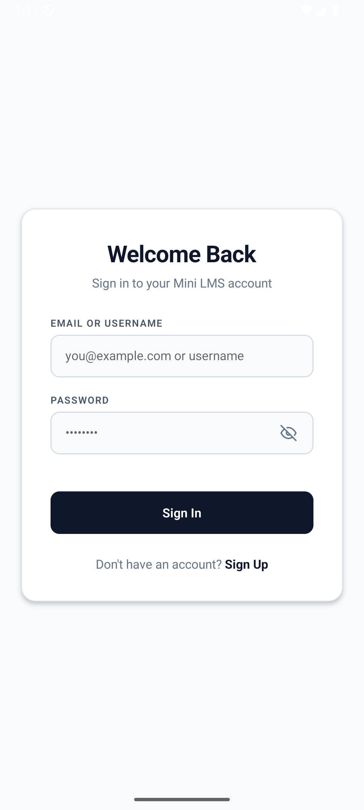
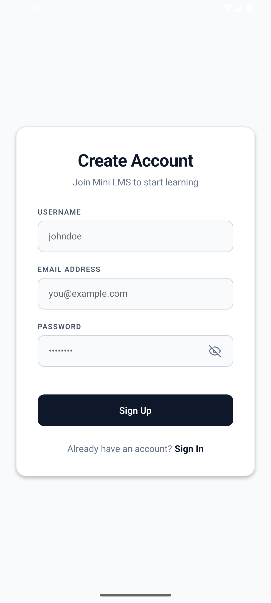
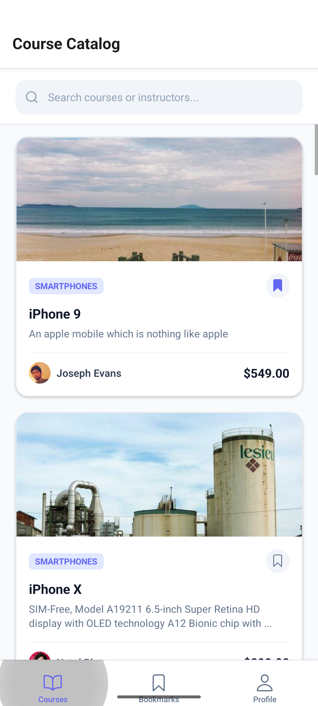
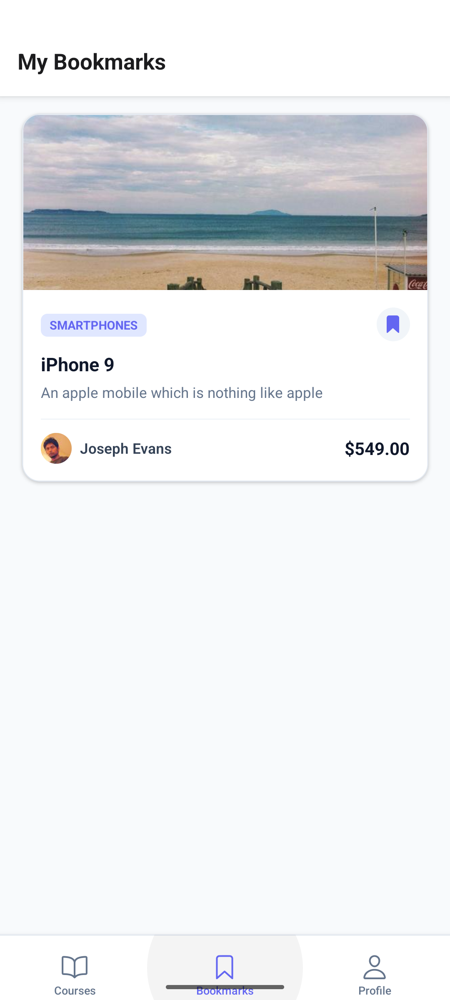
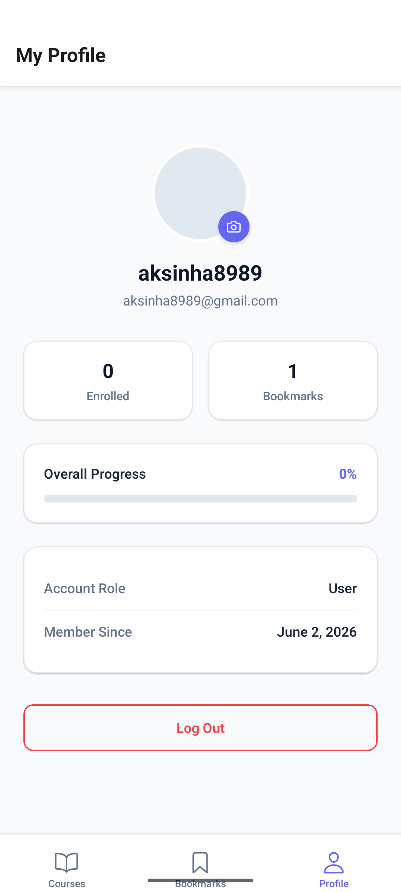

# Mini-LMS Mobile Application 🎓

A performance-optimized, production-ready Mini LMS Mobile Application built using **React Native Expo (SDK 56)**, featuring secure authentication, offline-first course catalog rendering, an embedded interactive WebView lesson content viewer, and intelligent local notifications.

### 📲 Download Signed Production APK
🚀 **[Download the Signed APK (Google Drive)](https://drive.google.com/file/d/1hMJ1lbrh9yB01VkdgK9OfJ8MrkkNG56x/view?usp=sharing)** — *Install directly on any Android device or emulator to test the completed application.*

---

## 📸 Screenshots

### 🔑 Authentication Flows

|       🔐 Login Screen        |         📝 Register Screen         |
| :--------------------------: | :--------------------------------: |
|  |  |

### 🏠 Course Catalog & Tab Screens

|        📚 Course Catalog         |         🔖 My Bookmarks          |        👤 User Profile         |
| :------------------------------: | :------------------------------: | :----------------------------: |
|  |  |  |

---

## 🚀 Key Features

### 1. Secure Authentication & User Management (Part 1)

- **Zod & React Hook Form Validation:** Implements strict client-side validation schema constraints.
- **Expo SecureStore Token persistence:** Access and Refresh tokens are secured in device-level hardware keychain storage.
- **Auto-Login & Silent Refresh:** Postpones session timeout checks and handles transparent, background JWT token refresh interceptors.
- **Profile Customization:** Integrates `expo-image-picker` to upload user avatar via `PATCH /users/avatar`.

### 2. Native Course Catalog & Bookmarking (Part 2 & Part 5.2)

- **LegendList Render Feed:** High-performance catalog feed with extremely low rendering overhead.
- **Zipped Datasets:** Parallels fetches of random products (courses) and random users (instructors) zipped dynamically.
- **Instant Bookmark Sync:** Reactively updates state using standard `extraData` props.
- **Smooth Pull-to-Refresh & Search:** Features instant query matching on title, description, and instructors.
- **List Caching:** Automatically saves data to `AsyncStorage` to serve catalog details during network outages.

### 3. Embedded Lesson Player via WebView (Part 3 & Part 6.2)

- **Bidirectional WebView Bridge:** Full interface wrapper allowing safe postMessage feedback loops to automatically record course completions.
- **Authentication Injection Handshake:** Securely passes custom headers (`X-LMS-User-Token`, `X-LMS-User-Role`, `X-LMS-Course-Id`) to authenticate web sessions.
- **Network Failure Interception:** Implements custom fallback error overlay routes with instant manual reload actions.

### 4. Intelligent Local Notifications (Part 4)

- **Milestone Alerts:** Detects when active bookmark catalogs cross the 5+ milestone and alerts the user.
- **24-Hour Postponed Idle Reminder:** Automatically schedules reminders that reschedule themselves whenever the app transitions between active lifecycle segments.

### 5. Network Resilience & Offline-First UI (Part 6.1)

- **Transient Request Retry Interceptor:** Retries failed or timed-out server operations up to 3 times using exponential backoff.
- **Slide-Down Global Offline Warning Banner:** Real-time network detection that shifts into display when offline, and slides away when online.

---

## 🛠️ Technology Stack

- **Framework:** React Native Expo (SDK 56)
- **Language:** TypeScript (Strict Mode)
- **State Management:** React Context (Auth + LMS states) & Custom Hooks (logic-view separation)
- **List Renderer:** `@legendapp/list/react-native`
- **Styling:** StyleSheet (Vanilla CSS design systems)
- **Network Client:** Axios (with custom retry interceptors)
- **Animations:** `react-native-reanimated`

---

## 📂 Project Structure

```
src/
├── app/                      # Expo Router files (Tab and Course routes)
│   ├── (auth)/              # Register & Login screens
│   ├── (tabs)/              # Courses, Bookmarks, and Profile tabs
│   ├── course/[id].tsx      # Native Course Details Screen
│   ├── webview.tsx          # WebView Embedded Content Player route
│   └── _layout.tsx          # App entry point, layouts, and global banner
├── components/               # Custom presentational components
│   ├── ui/                  # Reusable form elements (Button, InputField)
│   ├── CourseCard.tsx       # Performance-memoized list card item
│   ├── EmptyState.tsx       # Standard empty feeds layout
│   ├── LoadingView.tsx      # Standardized visual loading spinner
│   └── OfflineBanner.tsx    # Slide-down top banner for network detection
├── constants/                # Theme colors and constants
├── hooks/                    # Logic Separation (useAuth, useCourses, useBookmarks, etc.)
├── services/                 # External bindings (Axios api configuration, NotificationManager)
├── types/                    # Domain schemas and interfaces
└── utils/                    # Common functions (Responsive metrics, Image placeholders)
```

---

## ⚙️ Installation & Setup

Follow these steps to launch the project locally:

### 1. Prerequisites

Ensure you have Node.js (v18+) and npm installed.

### 2. Install Dependencies

Clone the repository, navigate to the folder, and run:

```bash
npm install
```

### 3. Setup Environment Variables

Create a `.env` file in the root directory (if needed by your server configs) or configure backend targets in [src/services/api.ts](file:///Users/razerak/Desktop/Mini-LMS/src/services/api.ts). The API Base points by default to:
`https://api.freeapi.app/api/v1`

### 4. Run Metro Bundler

Start the Metro server cleanly:

```bash
npx expo start -c
```

### 5. Launch Client Devices

- Press **`i`** to load the iOS Simulator.
- Press **`a`** to load the Android Emulator.
- Scan the QR code with the Expo Go mobile app (iOS/Android) to test on a physical device.

---

## 🛡️ Key Architectural & Security Decisions

### Custom Logic Separation (Hooks & Layouts)

Following professional React Native patterns, screen rendering files (`CoursesScreen.tsx`, `ProfileScreen.tsx`, `BookmarksScreen.tsx`) contain **no inline API, data mutations, or asynchronous handlers**. All operations are delegated cleanly to custom, highly typed hooks (`useCourses`, `useProfile`, `useBookmarks`), making the views thin, declarative, and easy to maintain.

### Secure Offline Cache Interceptor

Instead of blocking UI on transient timeouts or cellular dropouts, requests failing due to offline status or 5xx failures are captured by a custom interceptor. It retries the operation up to 3 times (using an exponential delay backoff of `1s`, `2s`, `4s`). If the retries fail, it falls back to zipping locally persisted AsyncStorage cache data, offering uninterrupted access.

### Bidirectional Webview authentication Injection

To authenticate content requests securely inside the embedded player, the app injects authentication tokens and course context on the fly:

1. Injects secure session parameters into the `headers` prop of the WebView request.
2. Injects a global script payload via `injectedJavaScript` directly into the WebView's document memory pool to display interactive debug handshakes inside the mock player.
3. Receives JSON message handlers over `onMessage` from the WebView to record progress milestones and pop the screen cleanly back to the native layer.

---

## 📡 Offline Functionality & Cache Strategy

The application leverages a multi-layer offline strategy to guarantee uninterrupted learning:

1. **Network State Monitoring:** Uses `@react-native-community/netinfo` to actively listen to cellular/Wi-Fi transitions.
2. **Axios Retry Interceptor:** Handles transient dropouts and 5xx errors by automatically retrying failed requests up to 3 times with exponential backoff delays (`1s`, `2s`, `4s`).
3. **AsyncStorage List Fallback:** Successful API responses are cached locally. If the user is completely offline or all request retries time out, the system transparently serves the cached catalog list.
4. **Offline Warning Banner:** An elegant slide-down banner alerts the user that they are browsing cached details.

---

## ⚙️ Environment Variables & Configs

The app handles settings directly at the API client interface:

- **API_BASE_URL:** Configured in `src/services/api.ts`. Defaults to `https://api.freeapi.app/api/v1` for the production endpoint.
- **Authentication Keys:** Tokens are dynamically retrieved from the device's hardware secure storage on start, requiring zero hardcoded credentials.

---

## 📦 APK Build & Store Submission Instructions

We utilize **EAS CLI** (Expo Application Services) to generate production-ready binaries:

### 1. Prerequisites

Ensure EAS CLI is installed and your account is linked:

```bash
npm install -g eas-cli
eas login
```

### 2. Build Development Build APK (for local testing)

```bash
eas build --platform android --profile development
```

### 3. Build Release/Preview APK (with bundled JS)

Configure `eas.json` for preview builds (with `"buildType": "apk"` under the android profile), then run:

```bash
eas build --platform android --profile preview
```

_Note: The generated APK link will be printed in the console and available on your EAS Dashboard._

---

## ⚠️ Known Issues & Limitations

1. **Android Expo Go Local Notifications Restriction:**
   Since Expo SDK 53/56, native local and push notification handlers are disabled by default inside the **Expo Go** application on Android, which can trigger system warnings or crashes. We resolved this by dynamically checking the runtime environment using `expo-constants` and conditionally loading `expo-notifications` via a `require` check, gracefully falling back to native `Alert.alert` milestones inside Expo Go Android.
2. **Mock Web Player:**
   The WebView lesson player simulates a video/interactive lesson layout using mock status updates and secure token handshakes since there is no active production video server attached to FreeAPI.
3. **Styling Framework Selection (NativeWind/Tailwind vs StyleSheet API):**
   Due to time constraints and version compatibility conflicts between NativeWind (v4/v5) and standard Expo SDK 56 modules in the development environment, I opted to use the native React Native **StyleSheet API** for all screens and components. This decision bypassed configuration blockers and ensured a highly consistent, premium dark-mode presentation with guaranteed 60 FPS rendering and native predictability.
